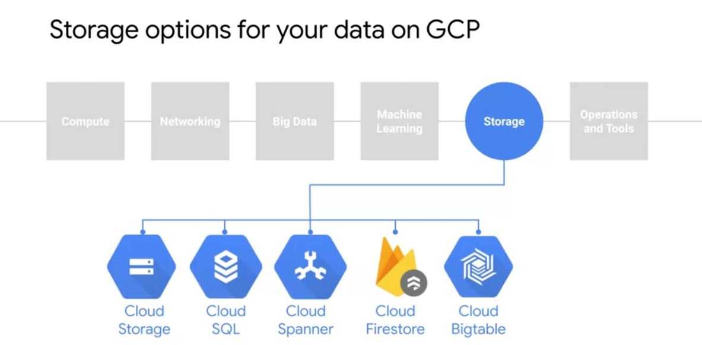
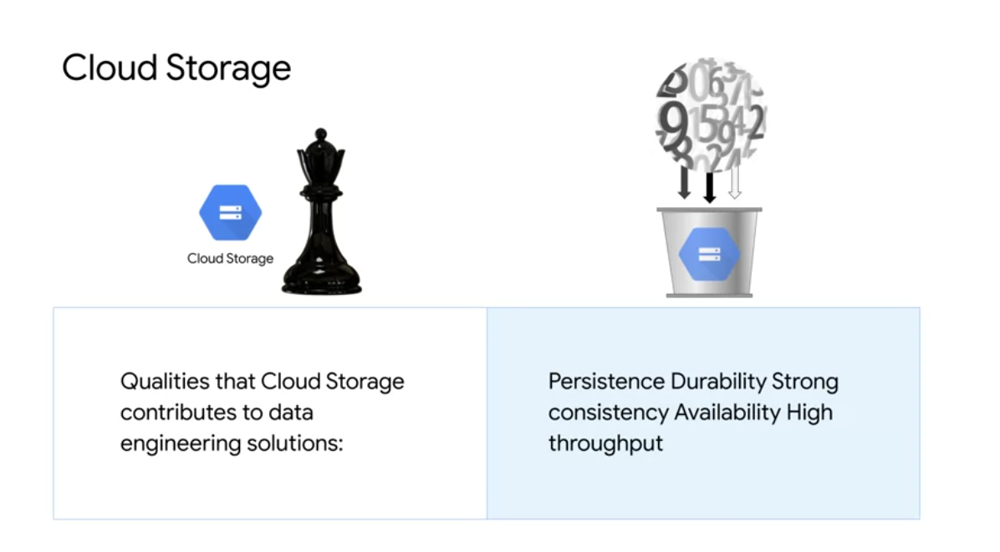
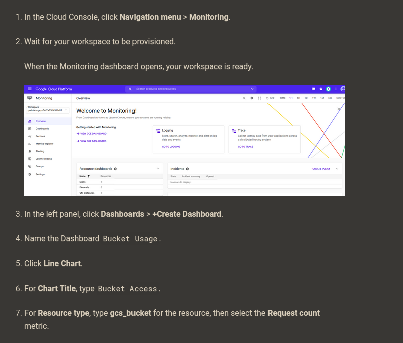
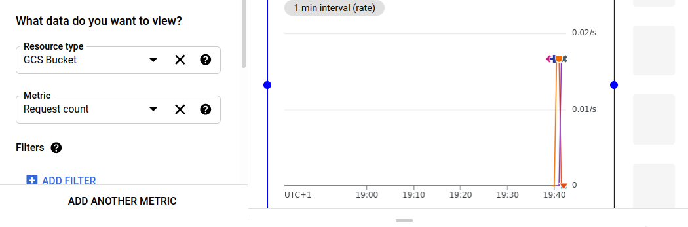

# What are data lakes?

Data sources
-> 
Data sinks (Our focus)
-> 
Data warehouse
->
Insights

Types of data storage



Cloud Storage



----------------

## Optimizing cost with Google Cloud Storage classes and Cloud Functions

### Enable APIs and clone repository

Enable API
```bash
gcloud services enable cloudscheduler.googleapis.com
```

Clone repos
```bash
git clone https://github.com/GoogleCloudPlatform/gcf-automated-resource-cleanup.git && cd gcf-automated-resource-cleanup/
```


```bash
export PROJECT_ID=$(gcloud config list --format 'value(core.project)' 2>/dev/null)
WORKDIR=$(pwd)
```
* [Set environment variables in bash](https://devconnected.com/set-environment-variable-bash-how-to/)   
* [value(core.project) meaning](https://stackoverflow.com/questions/35599414/gcloud-command-line-get-default-project-id)  
* [2>/dev/null meaning](https://askubuntu.com/questions/350208/what-does-2-dev-null-mean)

```bash
sudo apt-get install apache2-utils -y
```

### Create Cloud Storage buckets and add a file

```bash
cd $WORKDIR/migrate-storage
```

```bash
export PROJECT_ID=$(gcloud config list --format 'value(core.project)' 2>/dev/null)
gsutil mb -c regional -l us-central1 gs://${PROJECT_ID}-serving-bucket
```

```bash
gsutil acl ch -u allUsers:R gs://${PROJECT_ID}-serving-bucket
```
Make it public

```bash
gsutil cp $WORKDIR/migrate-storage/testfile.txt  gs://${PROJECT_ID}-serving-bucket

gsutil acl ch -u allUsers:R gs://${PROJECT_ID}-serving-bucket/testfile.txt
```
Copy txt to bucket.  
Make file public.

```bash
gsutil mb -c regional -l us-central1 gs://${PROJECT_ID}-idle-bucket
```
Create a second bucket called idle-bucket that won’t serve any data

### Create a Monitoring dashboard





### Generate load on the serving bucket

```bash
ab -n 10000 http://storage.googleapis.com/$PROJECT_ID-serving-bucket/testfile.txt
```
### Review and deploy the Cloud Function

```bash
cat $WORKDIR/migrate-storage/main.py | grep "migrate_storage(" -A 15
```

**Deploy the Cloud Function**

```bash
gcloud functions deploy migrate_storage --trigger-http --runtime=python37
```

Capture the trigger URL into an environment variable that you use in the next section:
```bash
export FUNCTION_URL=$(gcloud functions describe migrate_storage --format=json | jq -r '.httpsTrigger.url')
```

[jq meaning](https://shapeshed.com/jq-json/#how-to-pretty-print-json)   
[-r meaning](https://stedolan.github.io/jq/manual/)

### Test and validate alerting automation

```bash
export IDLE_BUCKET_NAME=$PROJECT_ID-idle-bucket
```

```bash
envsubst < $WORKDIR/migrate-storage/incident.json | curl -X POST -H "Content-Type: application/json" $FUNCTION_URL -d @-
```
https://www.gnu.org/software/gettext/manual/html_node/envsubst-Invocation.html

Check if bucket is NEARLINE
```bash
gsutil defstorageclass get gs://$PROJECT_ID-idle-bucket
```
