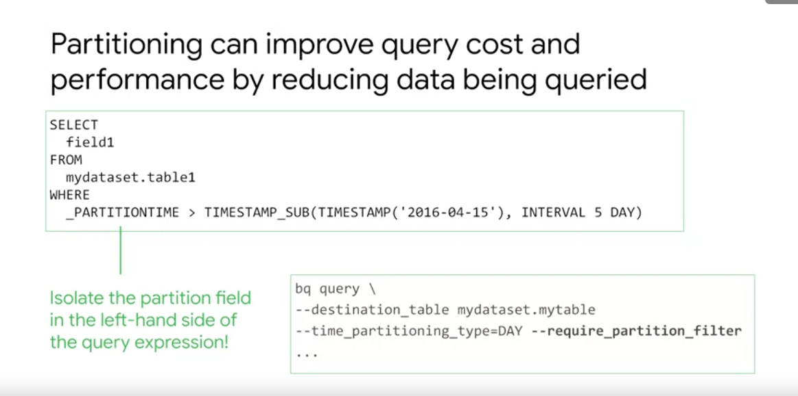
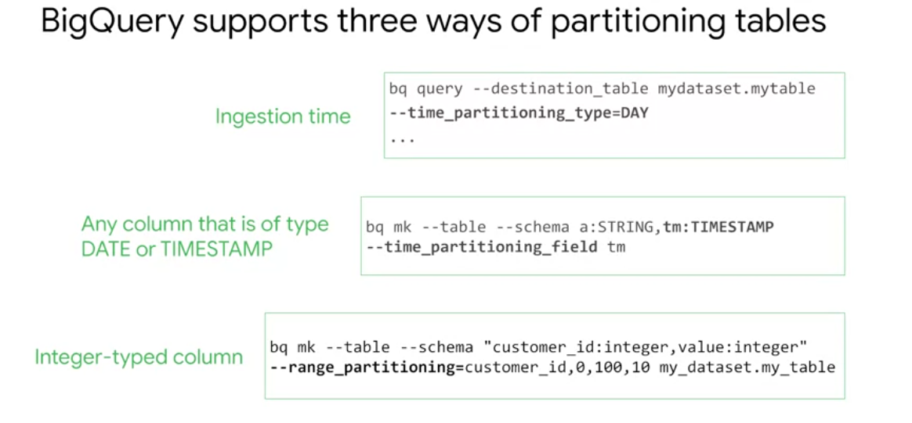
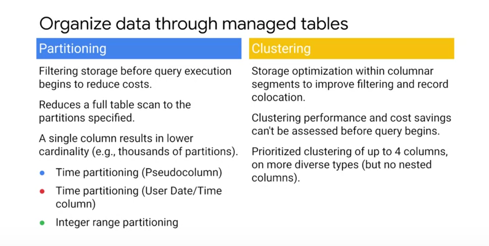

# Data Partitioning







[Github Demo on Partitioning](https://github.com/GoogleCloudPlatform/training-data-analyst/blob/master/courses/data-engineering/demos/partition.md)

## Hands on


```sql


SELECT
  fullVisitorId,
  date,
  ARRAY_AGG(DISTINCT v2ProductName) AS products_viewed,
  ARRAY_LENGTH(ARRAY_AGG(DISTINCT v2ProductName)) AS distinct_products_viewed,
  ARRAY_AGG(DISTINCT pageTitle) AS pages_viewed,
  ARRAY_LENGTH(ARRAY_AGG(DISTINCT pageTitle)) AS distinct_pages_viewed
  FROM `data-to-insights.ecommerce.all_sessions`
WHERE visitId = 1501570398
GROUP BY fullVisitorId, date
ORDER BY date
```

* finding the number of elements with ARRAY_LENGTH(<array>)
* deduplicating elements with ARRAY_AGG(DISTINCT <field>)
* ordering elements with ARRAY_AGG(<field> ORDER BY <field>)
* limiting ARRAY_AGG(<field> LIMIT 5)


```sql
#standardSQL
SELECT COUNT(participants.name) AS racer_count
FROM racing.race_results as r, r.participants
```

```sql
#standardSQL
SELECT COUNT(p.name) AS racer_count
FROM racing.race_results AS r, UNNEST(r.participants) AS p
```

## Quiz 

Question 1

Which of the following statements on BigQuery are true?
- [X] Data is run length-encoded and dictionary-encoded
- [X] Data on BigQuery is physically stored in a redundant way separate from the compute cluster
- [X] A BigQuery slot is a combination of CPU, memory, and networking resources
- [ ] The number of slots allotted to a query is independent of query complexity