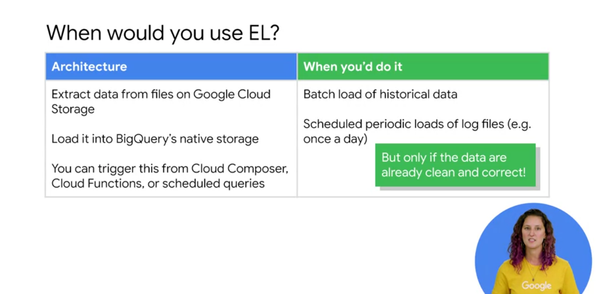
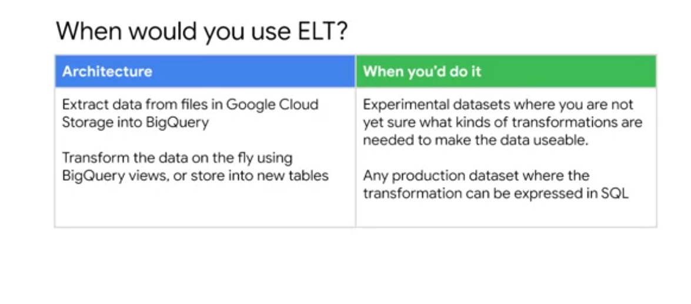
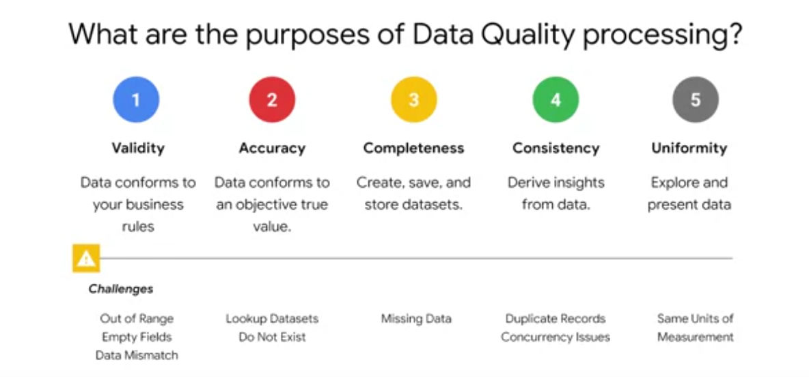
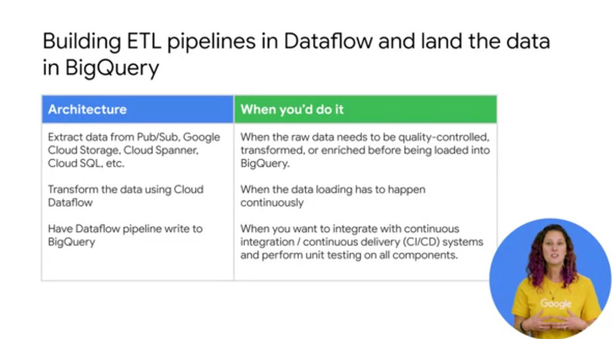
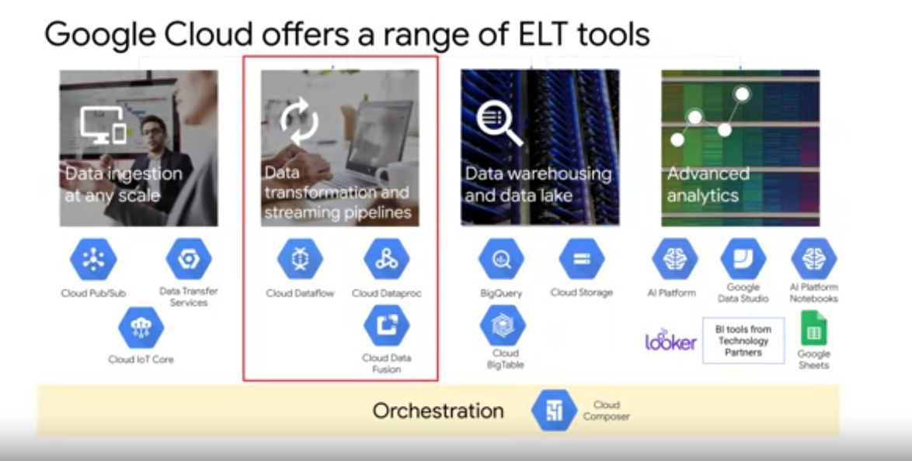

- Only use EL when the data is already correct and clean.

- BigQuery SQL has support for JSON parsing.

5 dimensions of data quality.

------------------

[GCP Architecture: CICD Pipeline for data processing](https://cloud.google.com/architecture/cicd-pipeline-for-data-processing)
- [DAG - Directed Acyclic graph](https://cloud.google.com/composer/docs/how-to/using/writing-dags)

-----------

- GCP Tools for ETL

Question 1

Which of the following is the ideal use case for Extract and Load (EL)
- Scheduled periodic loads of log files (e.g. once a day)

