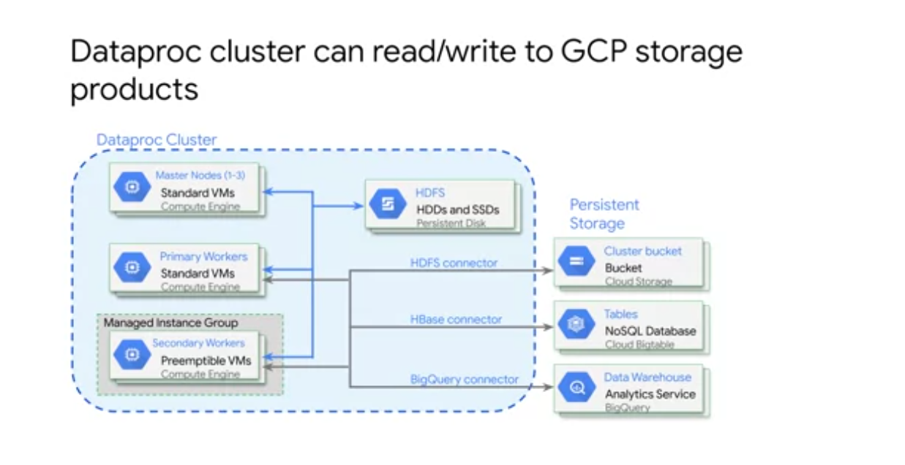
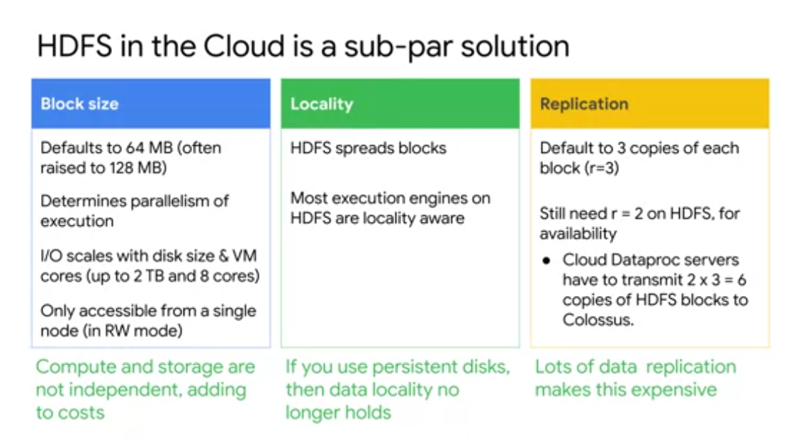
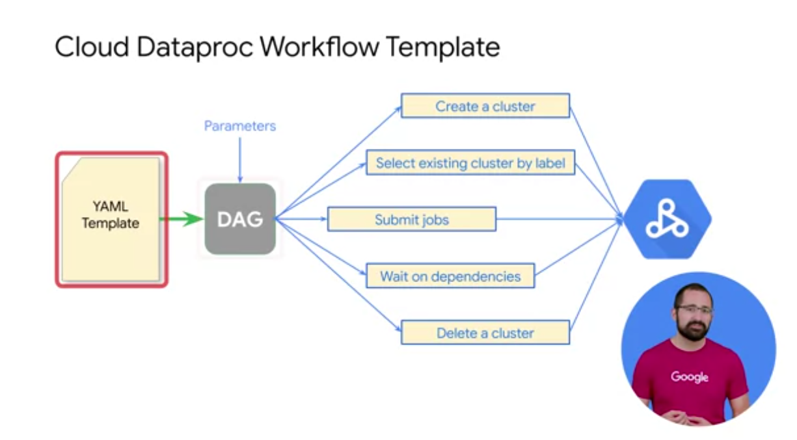
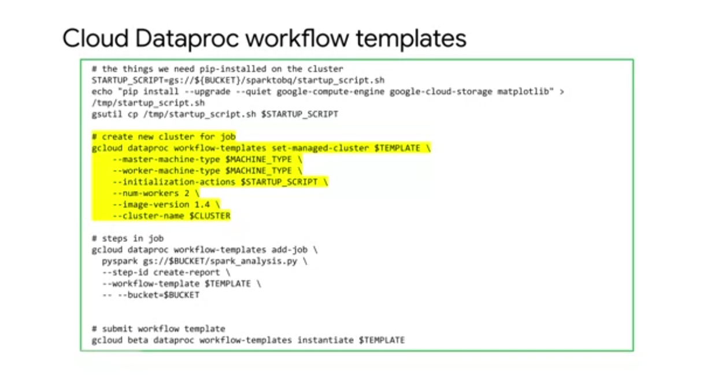
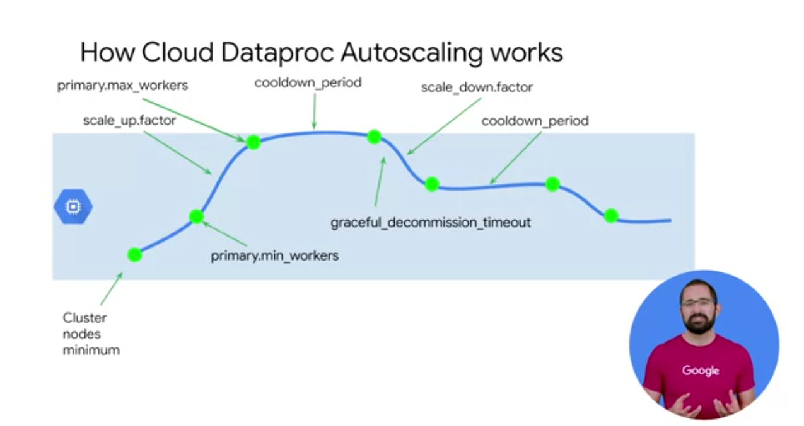
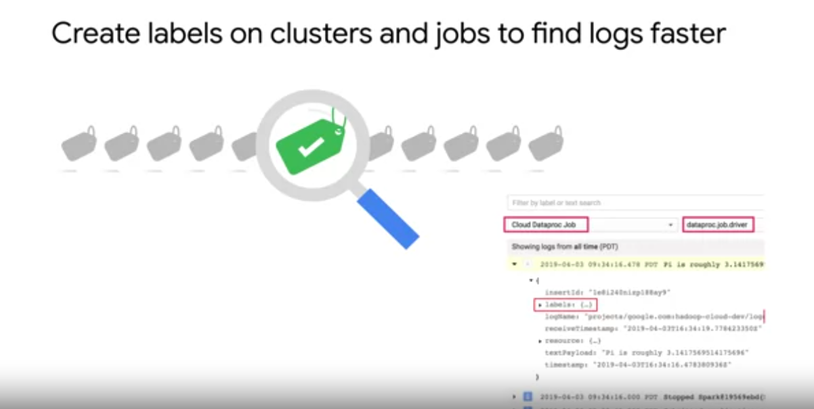

# Executing Spark on Cloud Dataproc

Hadoop
Stores it's data in HDFS (Hadoop Distributed File System)
- Disadvantage is that even when you are not running jobs, you have costs in persisting the storage.
- Cluster tuning and resource utilization, on premises can be time consuming and difficult to maintain.

Describe to Spark what you want to do, and let it do it's own thing.
Declarative Programming.

-------------

Job Utilization on Cloud Dataproc

- Utilize
  - Dont use hadoop direct interface
  - Jobs are not restartable by default.
  - Can create restartable jobs from the command line or RESTapi. Must be designed to be item potent (??) and to detect successorship and restore state.

----------------

## Why GCS and not HDFS

Local HDFS is a good option if your job requires a lot of metadata operations.
For example, you have thousands of partitions and
directories, and each file size is relatively small.
Or you modify the HDFS data frequently or rename directories often.
Cloud storage objects are immutable, so
renaming a directory is an expensive operation.
Because it consists of copying all objects to a new key and
then deleting them afterwards.

But in general we recommend using cloud storage as the initial and
final source of data in your big data pipeline. 

It's currently available through the gcloud command and the rest API but
not through the console. 

Example 

### Autoscaling

### Logging

- Can create
a label with the key environment or
ENV as the value in the exploration
and then use it as part of your data exploration job. 
- Can then get logs for
all exploration jobs by creating and
filtering with the label environment with
a value exploration in logging. 

Set the driver log level
using the following G-Cloud command,
gcloud dataproc jobs submit
hadoop with the parameter driver-log-levels. 

------------

