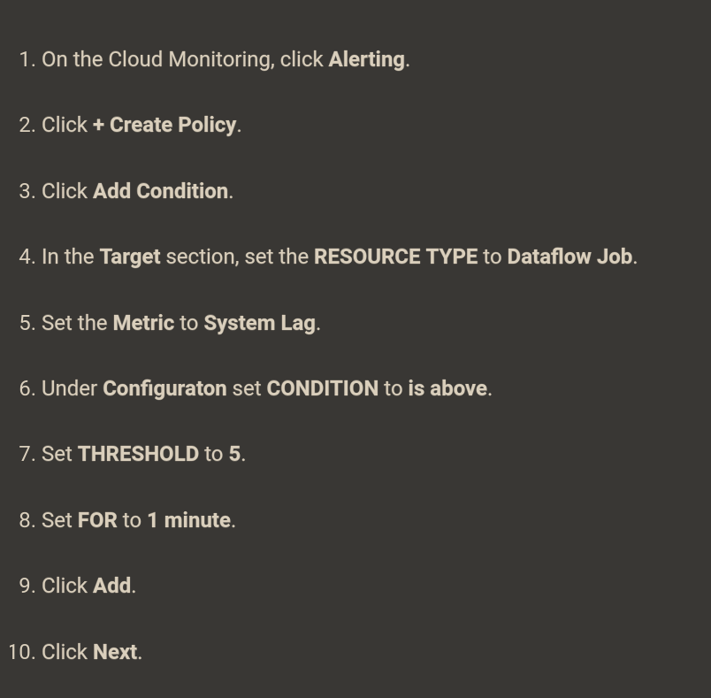
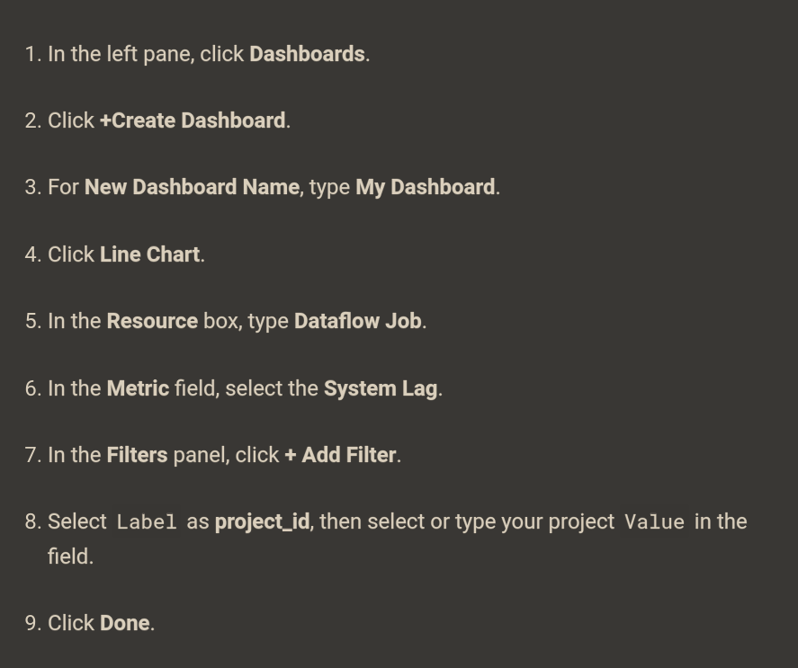

# Streaming Data Processing: Streaming Data Pipelines

id:

qwiklabs-gcp-00-7bf92a83e0a6 


## Prep

Compute Engine > VM Instances

```bash
git clone https://github.com/GoogleCloudPlatform/training-data-analyst
source /training/project_env.sh
```
THis will download the git repo and setup the environment variables for the machine.

## Prep BigQuery and GCS

JUsrt create a bigquery dataset with the name `demos`

## Simulate Pub/Sub data

Run the following command in the VM

```bash
/training/sensor_magic.sh
```

Open new VM SSH

Setup environment variables 
```bash
source /training/project_env.sh
```

##  Launch Dataflow Pipeline

Run in the second SSH

```bash
cd ~/training-data-analyst/courses/streaming/process/sandiego

./run_oncloud.sh $DEVSHELL_PROJECT_ID $BUCKET AverageSpeeds
```

[java code](https://github.com/GoogleCloudPlatform/training-data-analyst/blob/master/courses/streaming/process/sandiego/src/main/java/com/google/cloud/training/dataanalyst/sandiego/AverageSpeeds.java)

Check in BQ the averageSpeed table

## Determine throughput rates


* System Lag is an important metric for streaming pipelines. It represents the amount of time data elements are waiting to be processed since they "arrived" in the input of the transformation step.

* Elements Added metric under output collections tells you how many data elements exited this step (for the Read PubSub Msg step of the pipeline it also represents the number of Pub/Sub messages read from the topic by the Pub/Sub IO connector).

## Review BigQuery output

IN BQ

```sql
SELECT *
FROM `demos.average_speeds`
ORDER BY timestamp DESC
LIMIT 100
```

Or find max timestamp
```sql
SELECT
MAX(timestamp)
FROM
`demos.average_speeds`
```

Subset that existed 10 minutes ago:
```sql
SELECT *
FROM `demos.average_speeds`
FOR SYSTEM_TIME AS OF TIMESTAMP_SUB(CURRENT_TIMESTAMP, INTERVAL 10 MINUTE)
ORDER BY timestamp DESC
LIMIT 100
```

## Observe and understand autoscaling

GO to DataFlow > Job > Job Metrics

Check Autoscaling graph (and More History)
Status tells the number of workers when and why.

## Refresh the sensor data simulation script

...


##  Explore metrics

Monitoring > Explore Metrics

Resource: Dataflow Job

Metrics: Data watermark lag | System Lag

* Data watermark lag: The age (time since event timestamp) of the most recent item of data that has been fully processed by the pipeline.

* System lag: The current maximum duration that an item of data has been awaiting processing, in seconds.

[Monitoring Metrics available](https://cloud.google.com/monitoring/api/metrics_gcp)


## Create alerts

Monitoring > Alerting 



Define A communication channel

bla bla

## Set up dashboards



You can add more charts to the dashboard, if you would like, for example, Pub/Sub publish rates on the topic, or subscription backlog (which is a signal to the Dataflow auto-scaler).

## Launch another streaming pipeline

https://github.com/GoogleCloudPlatform/training-data-analyst/blob/master/courses/streaming/process/sandiego/src/main/java/com/google/cloud/training/dataanalyst/sandiego/CurrentConditions.java


