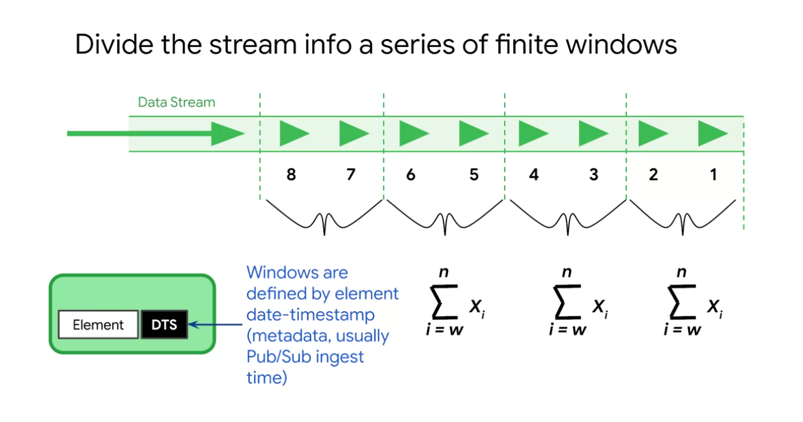
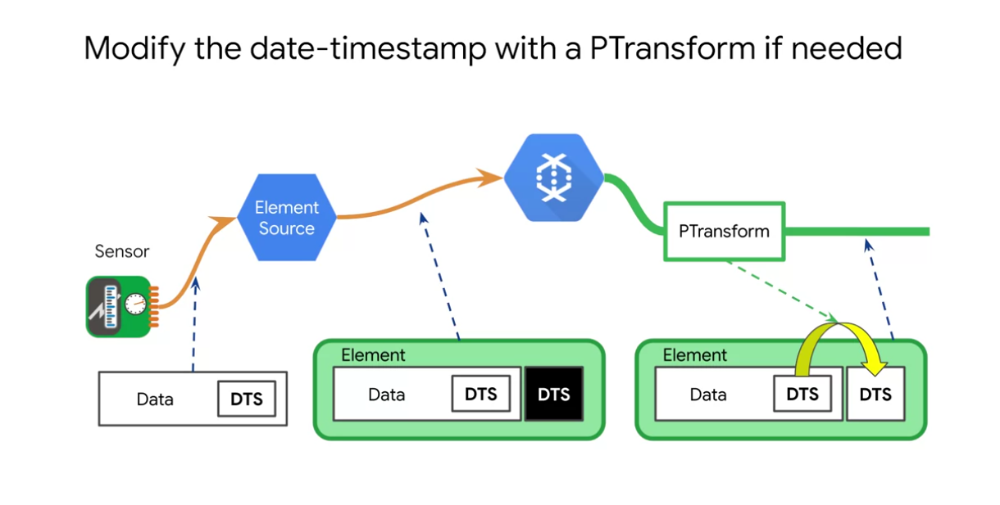
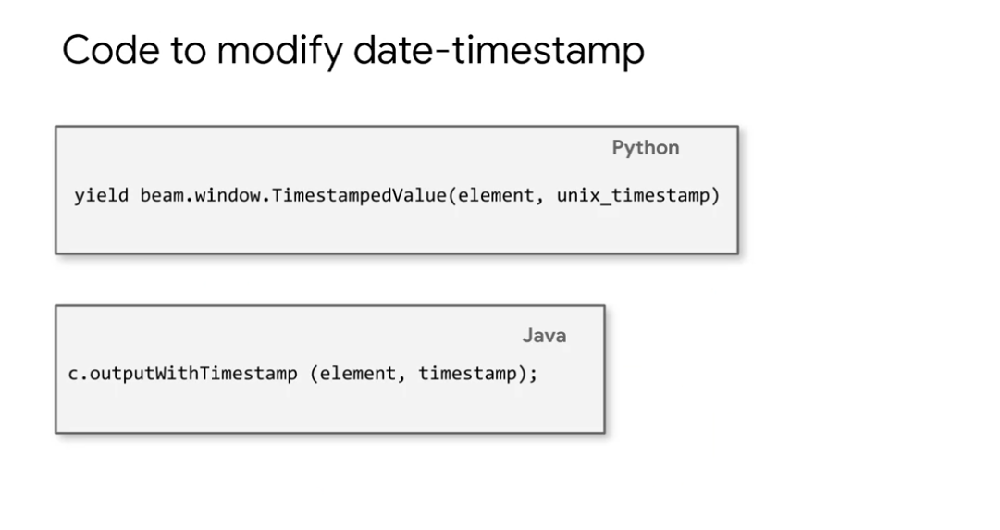

# Cloud Dataflow capabilities for streaming data

To calculate for example the average of unbounded.
Cut the average to windows.

Dataflow does this for you.

In dataflow, when you are reading messages from Pub/Sub,
every message will have a time stamp that is just a Pub/Sub message timestamp.
And then you will be able to use this timestamp
to put it onto the different time windows and aggregate all over of those windows. 

If you want to modify a timestamp and
have it based on some property of your data itself, you can do that too.
Every message that comes in, for example,
the sensor provides its own date timestamp as part of the message. 

There's a lot to say about windowing.