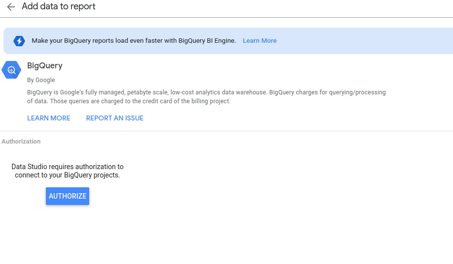
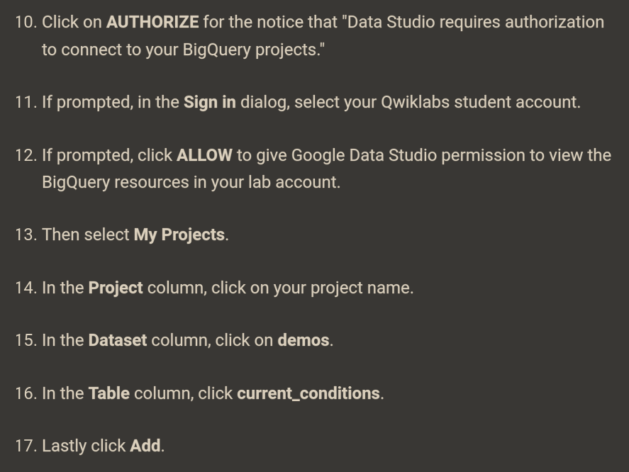
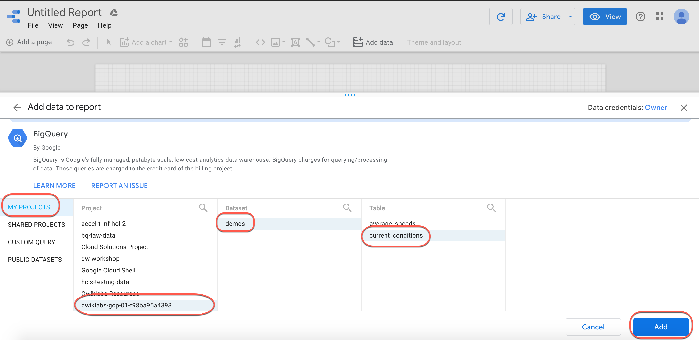
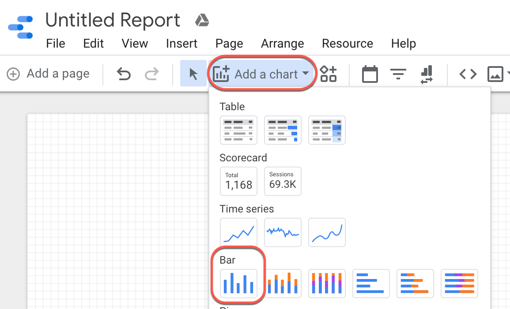
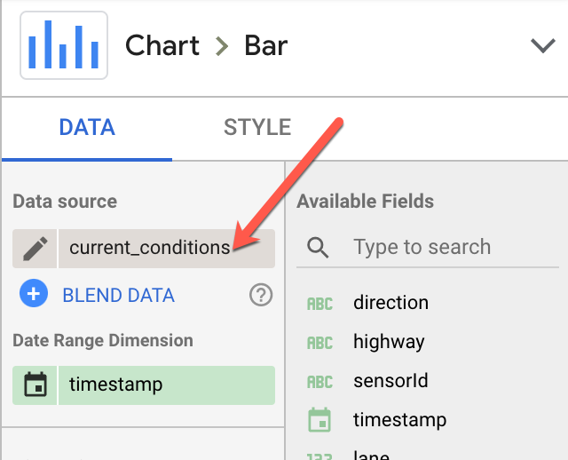

# Streaming Data Processing: Streaming Analytics and Dashboards

* Open VM instance
* Clone repo
* Set environment variables

## Creating a data source in Data Studio

Go to [DataStudio](https://datastudio.google.com/)

Create a Blank report





## Creating a bar chart using a calculated field



... 

## Creating a chart using a custom query



BigQuery -> Custom Query

E.g.: 
```sql
SELECT max(speed) as maxspeed, min(speed) as minspeed,
avg(speed) as avgspeed, highway
FROM `<PROJECTID>.demos.current_conditions`
group by highway
```

