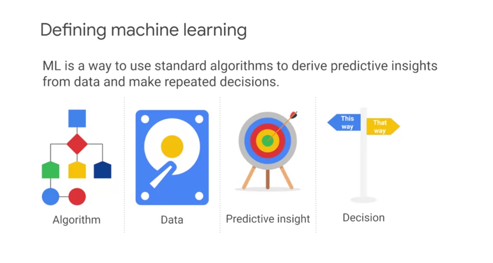
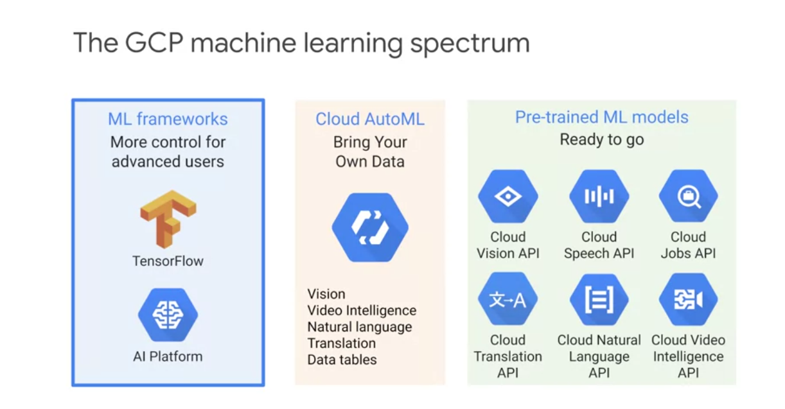
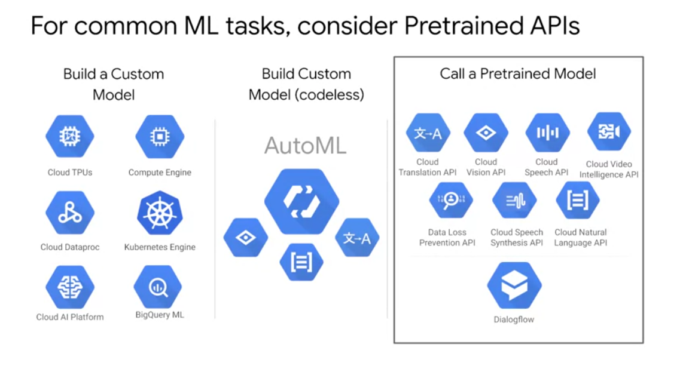

# Analytics and AI

## Quiz: Introduction to Analytics and AI

Q1.  
What is the difference between AI and ML?

* AI is a discipline while ML is a toolset

Q2   
What is the primary impact of ML?
*  It allows business operations to scale

## Prebuilt ML model APIs

## Quiz: Prebuilt ML model APIs for Unstructured Data

Q1.
Most business data is unstructured data, and mainly text
(True/False)
* True

Q2.
Google Cloud's pretrained model APIs use:
* Google's models and Google's data