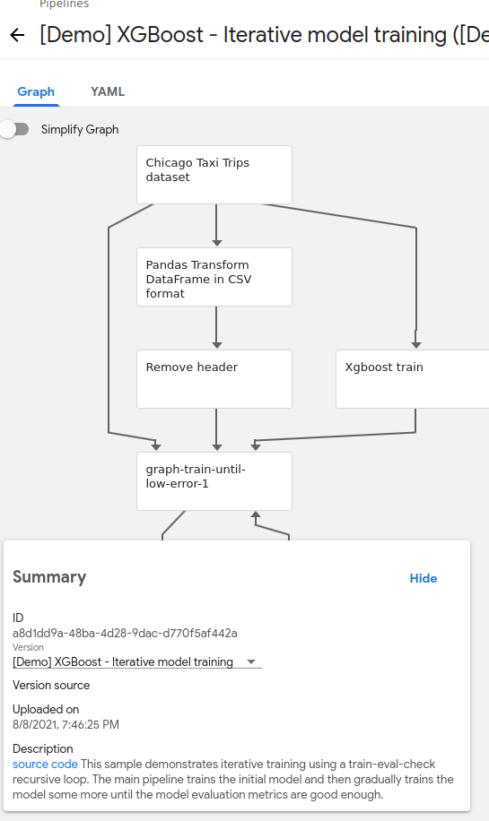

# Running ML Pipelines on Kubeflow 

https://cloud.google.com/blog/products/ai-machine-learning/getting-started-kubeflow-pipelines

https://github.com/kubeflow/pipelines/blob/master/samples/core/xgboost_training_cm/xgboost_training_cm.py

Create GKE cluster:
```bash
gcloud container clusters create cluster-1 --zone us-central1-a --cluster-version 1.18.20 --machine-type n1-standard-2 --enable-basic-auth --scopes=https://www.googleapis.com/auth/cloud-platform
```

Wait 2-3 minutes for the cluster to start.

Go to AI Platform > Pipelines

New Instance > Configure

The cluster created will appear by default in the selection window.

* Deploy
 You will see the individual services of KFP deployed to your GKE cluster. Wait for the deployment to finish before proceeding to the next task.

Go to AI Platform > Pipelines

OPEN PIPELINES DASHBOARD -> Pipelines




Create Experiment > my-first-experiment > Start

Wait and see.


