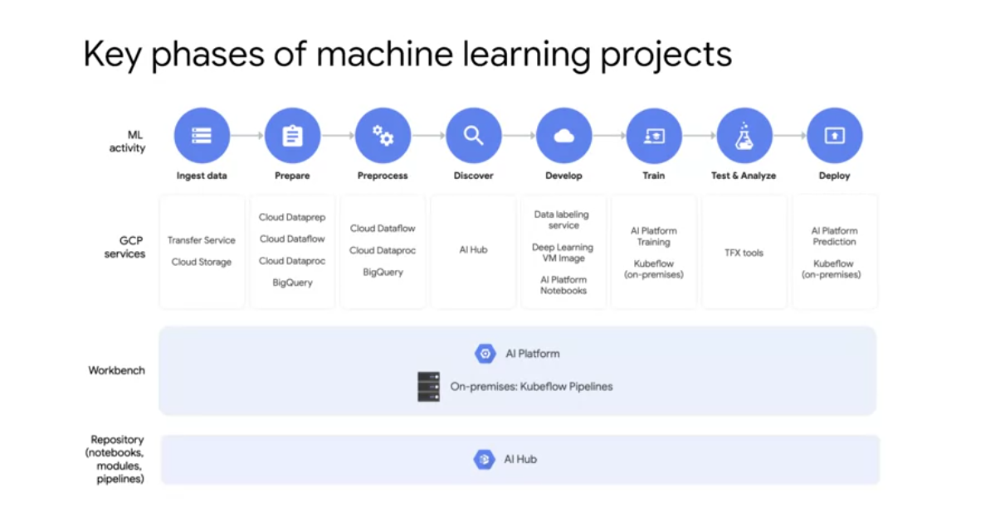
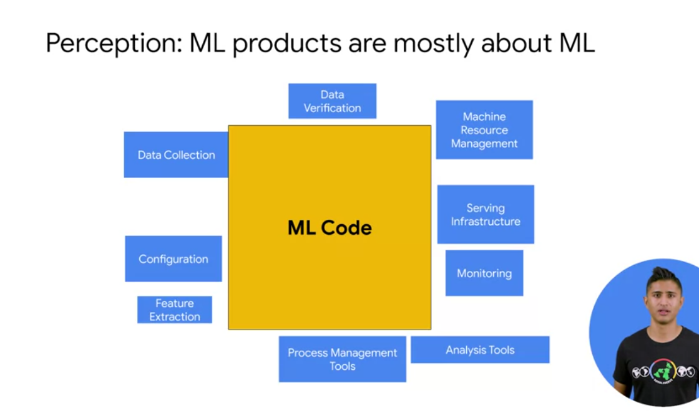

# Productionizing custom ML models

## Phases of ML Projects

## Kubeflow

Production ML systems are complicated and large.

Kubeflow works with pipelines

    By defining the workflow, we mean specifying each steps; inputs and outputs, and how the various steps are connected. The topology of the workflow is implicitly defined by connecting the outputs of an upstream step to the inputs of a downstream step. You can also define looping constructs as well as conditional steps. Another nice Kubeflow feature is the ability to package pipeline components. This adds an element of portability since you can then move your ML pipelines even between Cloud providers. Kubeflow Pipelines separate the work for different parts of the pipeline to enable people to specialize. For example, a ML engineer can focus on feature engineering and the other parts of creating the model such as hyperparameter tuning. The ML engineer solutions can then be bundled up and used by data engineer as part of a data engineering solution. The solution can then appear as a service used by data analysts to derive business insights. 