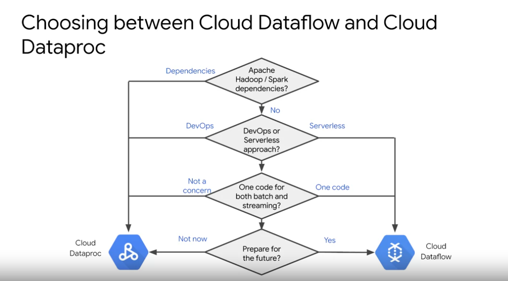
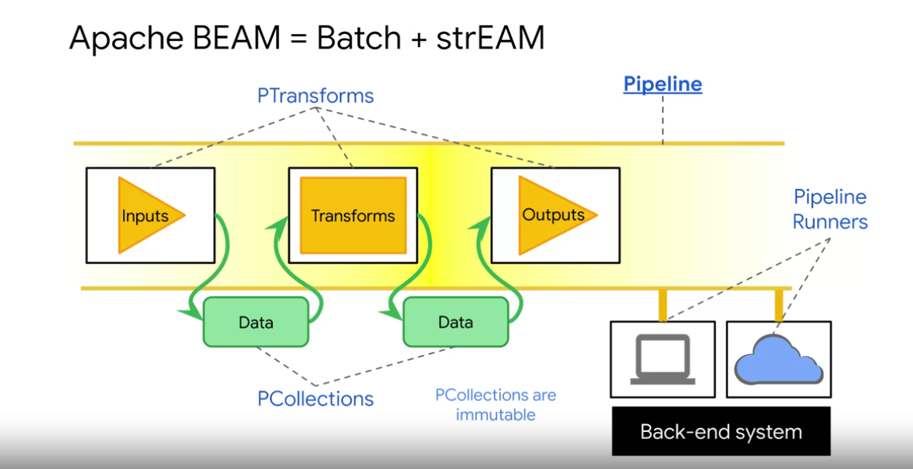
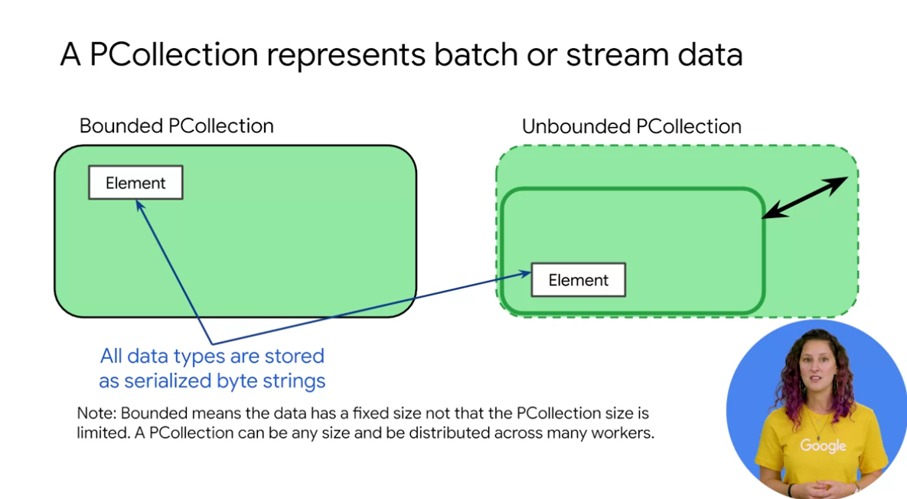
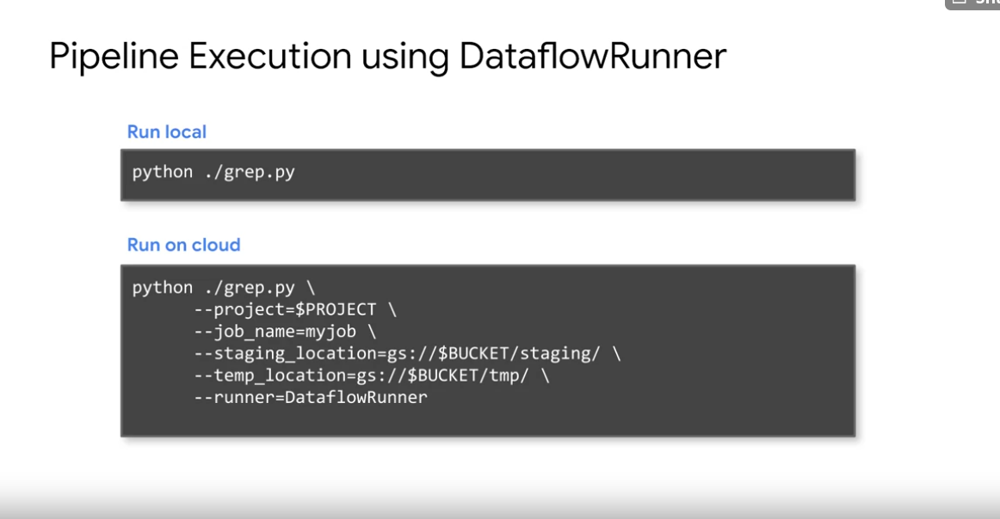
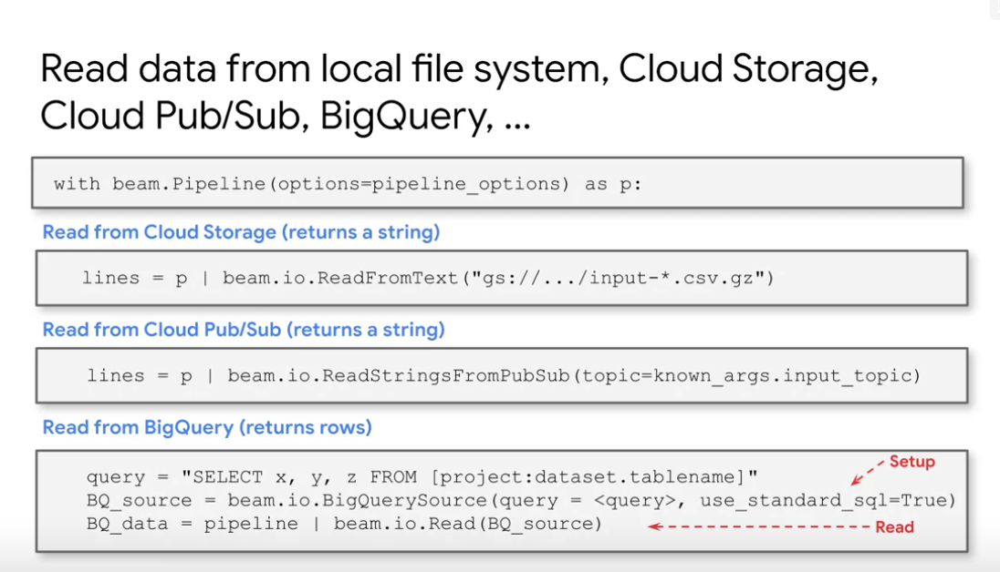

# Running batch processing pipelines on Cloud Dataflow

Differences between Dataflow and Dataproc


Choosing between Dataflow and Dataproc


---------


 - A pipeline identifies the data to be
processed and the actions to be taken on the data.
- The data is held in
a distributed data abstraction called a Pcollection. This Pcollection is immutable.
- Actions or code is contained
in an abstractio


- Pcollection: Parallel Collection
- Serialized through the whole pipeline, except when required for a transformation by PTransform


-----------




[Apache BEAM documentation Python](https://beam.apache.org/documentation/programming-guide/)


------

[Dataflow + Apache BEAM Tutorial](https://googlecoursera.qwiklabs.com/focuses/17005400?parent=lti_session)

-------

## Serverless Data Analysis with Dataflow: MapReduce in Dataflow (Python) 
https://googlecoursera.qwiklabs.com/focuses/17009268?

Task 2
What custom arguments are defined?

What is the default output prefix?
* output_prefix
* input

How is the variable output_prefix in main() set?
* As a tag in the command line

How are the pipeline arguments such as --runner set?

What are the key steps in the pipeline?

Which of these steps happen in parallel?

Which of these steps are aggregations?

```python
   (p
      | 'GetJava' >> beam.io.ReadFromText(input)
      | 'GetImports' >> beam.FlatMap(lambda line: startsWith(line, keyword))
      | 'PackageUse' >> beam.FlatMap(lambda line: packageUse(line, keyword))
      | 'TotalUse' >> beam.CombinePerKey(sum)
      | 'Top_5' >> beam.transforms.combiners.Top.Of(5, key=lambda kv: kv[1])
      | 'write' >> beam.io.WriteToText(output_prefix)
   )
   ```
Study this better
[!]


------------

## Serverless Data Analysis with Dataflow: Side Inputs (Python) 

https://googlecoursera.qwiklabs.com/focuses/17009523

```python
  if opts.DirectRunner:
    runner='DirectRunner'
  if opts.DataFlowRunner:
    runner='DataFlowRunner'
```
What's the difference?


-----

There are [template pipelines](https://cloud.google.com/dataflow/docs/concepts/dataflow-templates)   
[Google Provided templates](https://cloud.google.com/dataflow/docs/guides/templates/provided-templates)

# Quiz Data Processing with Cloud Dataflow

Q1.
Which of the following statements are true?
- [X] Dataflow executes Apache Beam pipelines
- [ ] Side-inputs in Dataflow are a way to export data from one pipeline to share with another pipeline
- [ ] Map operations in a MapReduce can be performed by Combine transforms in Dataflow
- [X] Dataflow transforms support both batch and streaming pipelines

Q2.
| Term              	| Definition                                              	|
|-------------------	|---------------------------------------------------------	|
| __ 1. Transform   	| A. Output endpoint for your pipeline                    	|
| __ 2. PCollection 	| B. A data processing operation or step in your pipeline 	|
| __ 3. Sink        	| C. A set of data in your pipeline                       	|

1.B  
2.C  
3.A  

