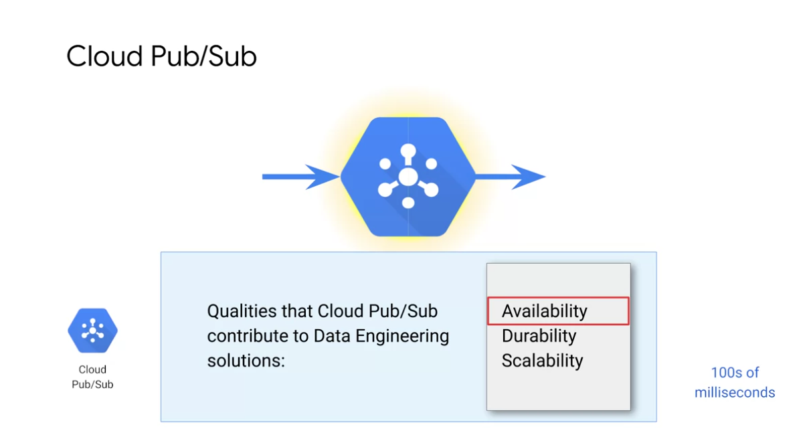
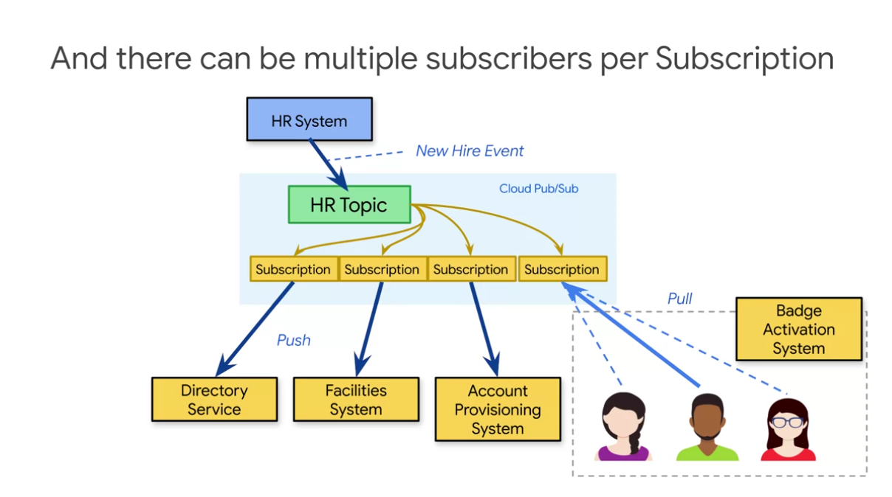
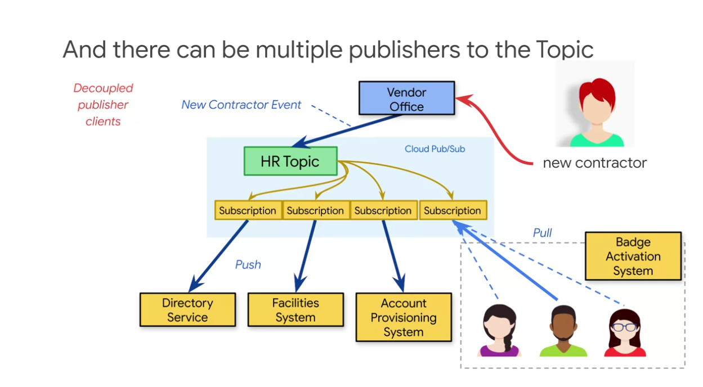
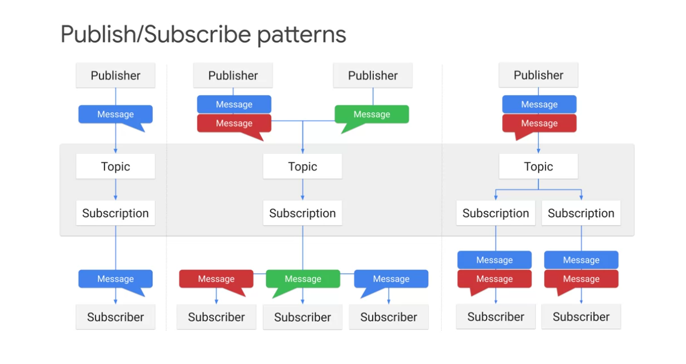
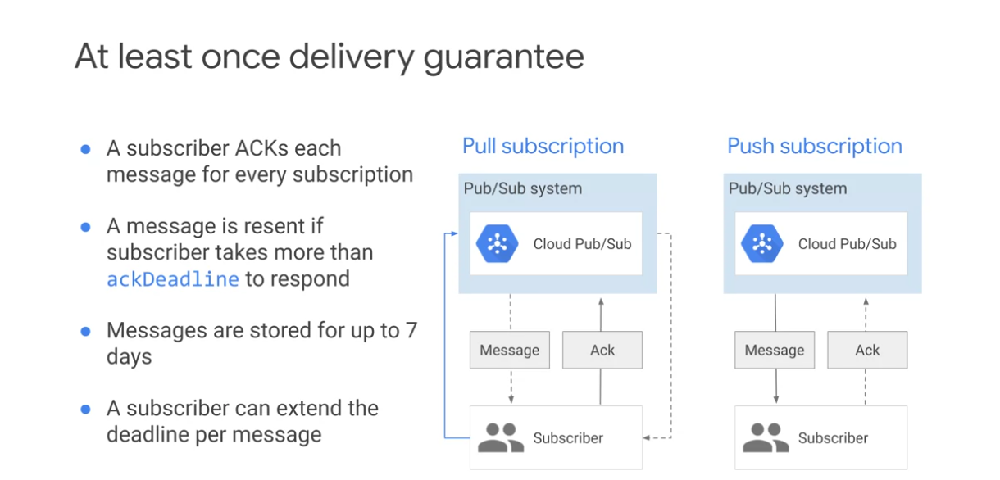
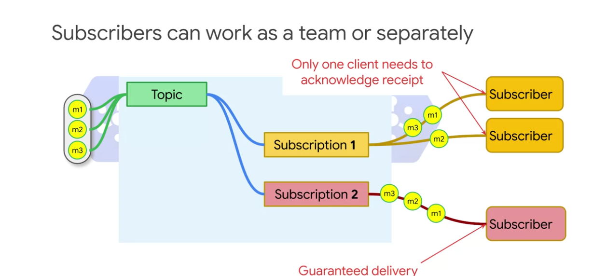
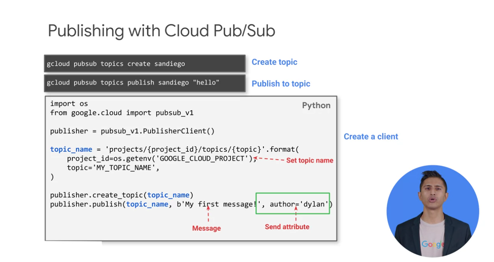
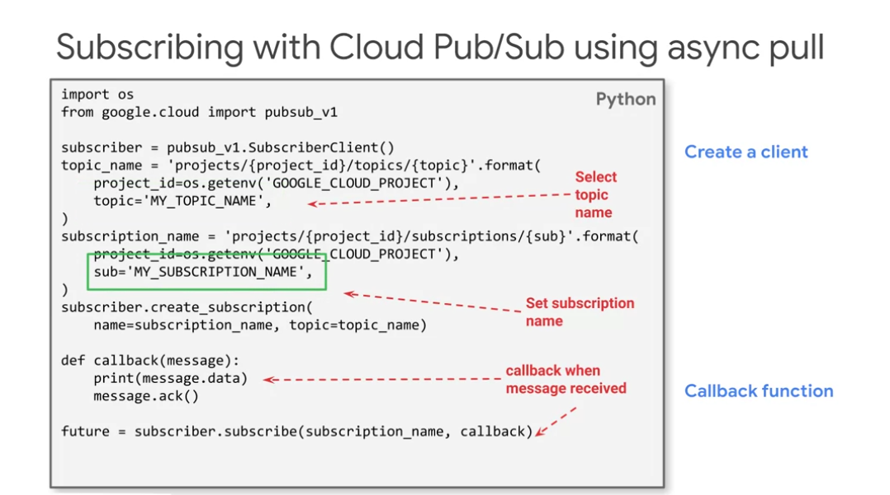
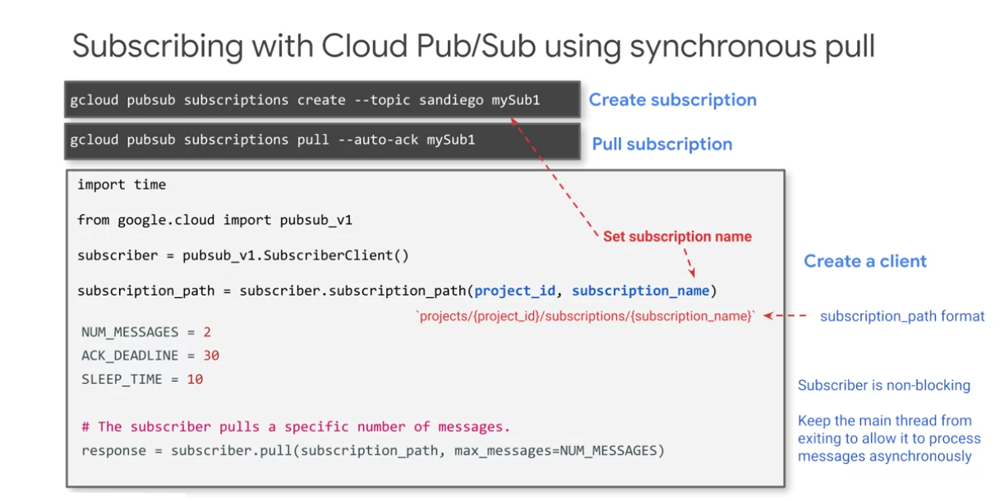

# Cloud Pub/Sub

HIPPA compliant

Cloud Pub/Sub has a buffer that saves the data for 7 days.

Cloud Pub/Sub can serve as an intermediary for applications.
It can save you from attacks or unexpected high demand.

There can be more than one publisher.

There are two different techniques for the subscribers.
Push and Pull.

1 - Simple one publisher feeds, one subscriber is fed.

2 - Fan In - Multiple publishers feed, multiple subscribers are fed. Good in parallel.

3 - Fan Out - Many use cases for the same piece of data. One publhser and several subscribers.

In pull, clients call for subscribers. Gets the message back and then acknowledges the message.

In push delivery, Cloud Pub/Sub initiates requests your subscriber application, to deliver messages. The Cloud Pub/Sub servers sends each message as an HTTPS request to the subscriber application. you just respond with status 200 Okay for the HTTP call, and that tells Pub/Sub the message delivery was successful. Push delivery is ideal when multiple topics must be processed by the same webhook for example. 

Work alone as a team.
For example with a container getting fed, and distributing to the other services. This container can have autoscale, which makes this type of arquitecture a good pattern.

-----------

