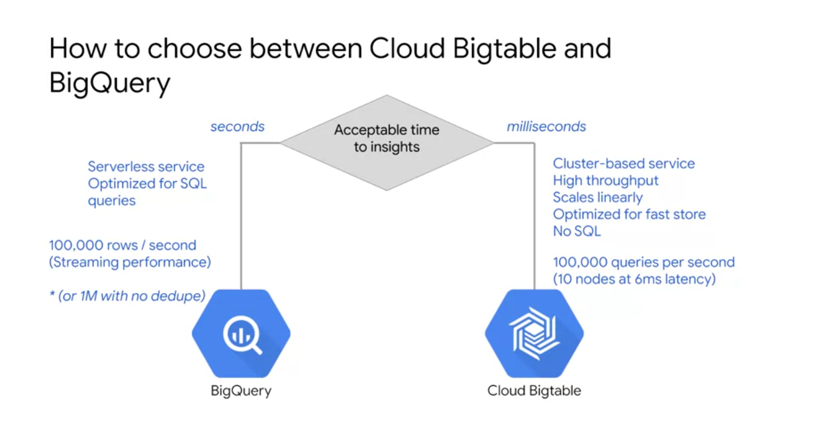
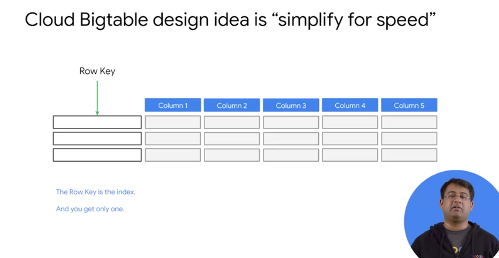
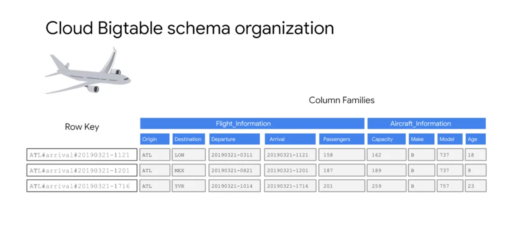
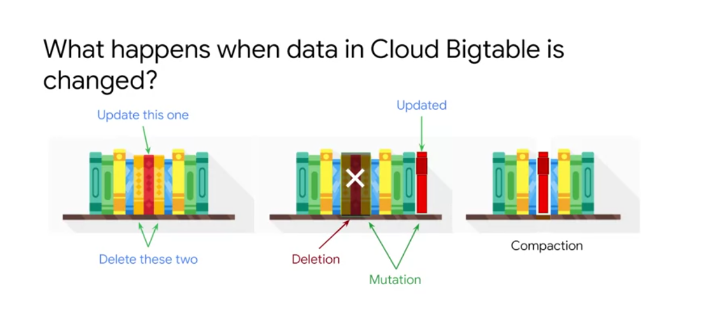
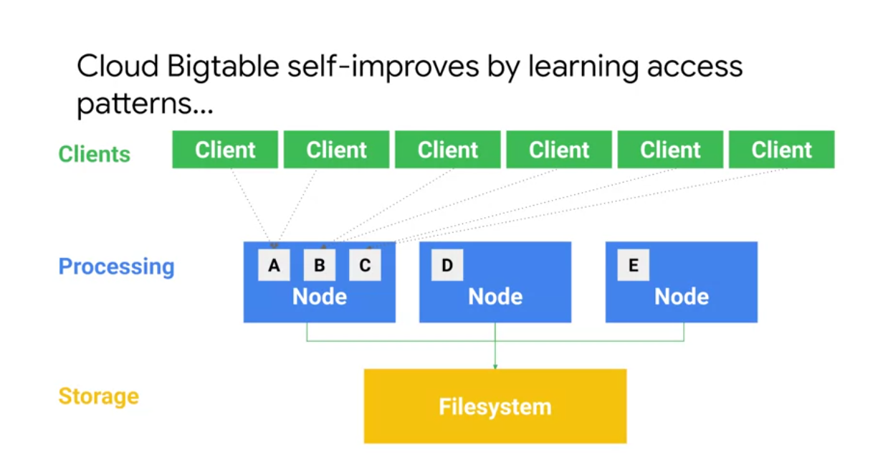
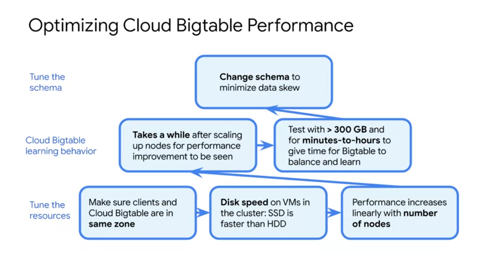
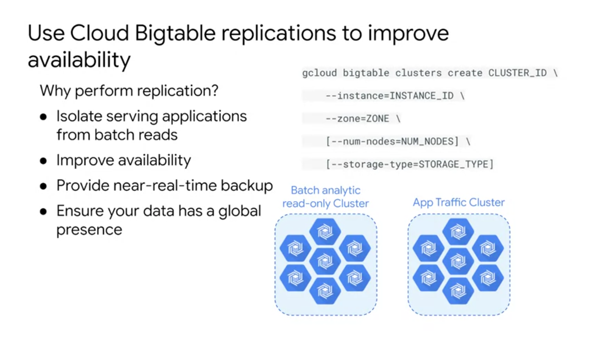

# Streaming into Cloud BigTable

## High-Throughput Streaming with Cloud Bigtable

We have to construct a row key that can be indexed and easily searched for our use case.

BigTable allows for Family columns, to retrieve only data regarding one dimension of data.

Cloud Bigtable periodically rewrites your table to remove deleted entries, and to reorganize your data so that reads and writes are more efficient.   
It tries to distribute reads and writes equally across all Cloud Bigtable nodes. 
In this example, A, B, C, D, E are not data, but rather pointers or references and cache, which is why re-balancing is not time-consuming. 
We are just moving pointers. Actual data is in tablets in Colossus file system. 
Based on the learned access patterns, Bigtable re-balances data accordingly, and balances the workload across the nodes. 

## Optimizing Cloud Bigtable Performance

