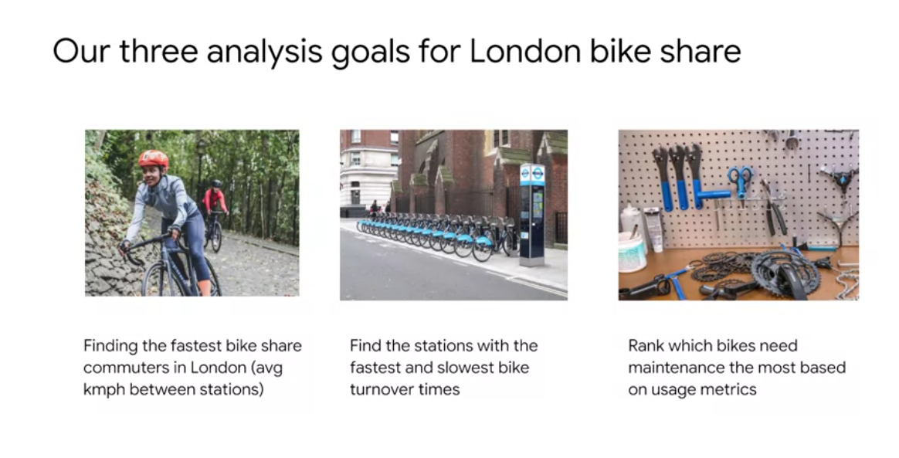
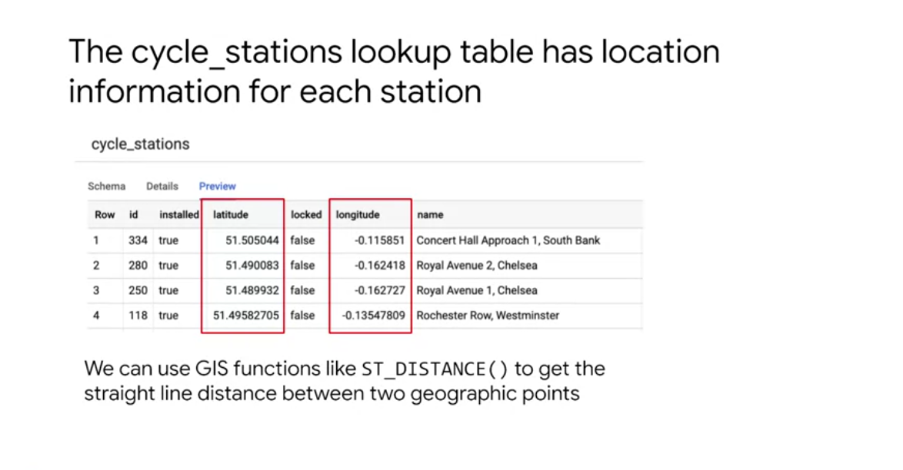
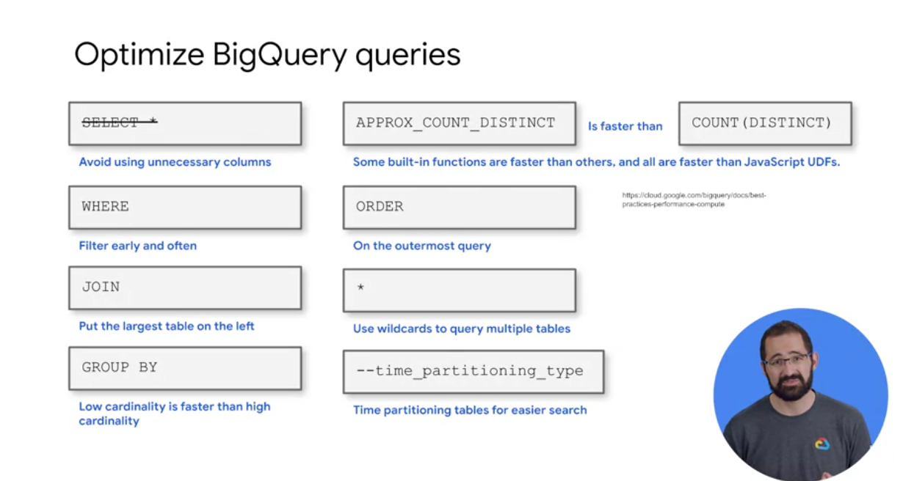

# BigQuery: advanced funcionality

Using 2015-2017 London bike rides

ST = Spatial Type
Optimized for GIS data

The notebook on this code [is here](https://github.com/GoogleCloudPlatform/training-data-analyst/blob/master/courses/data-engineering/demos/advanced_sql_functions.md).

----

## Cheat Sheet

