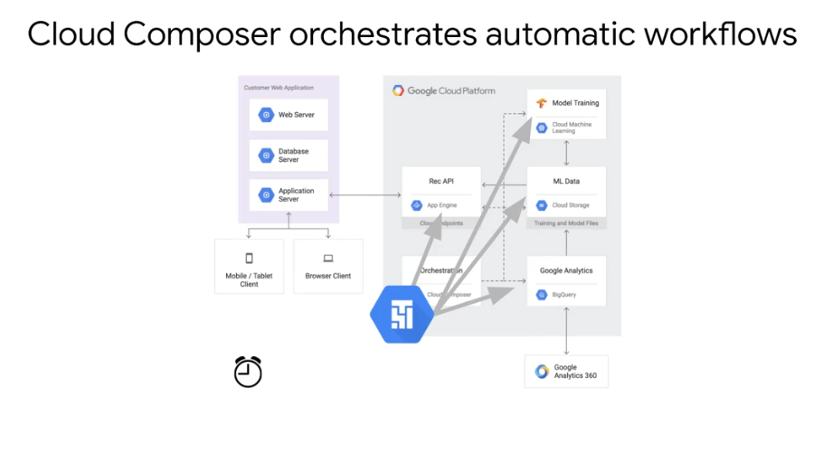
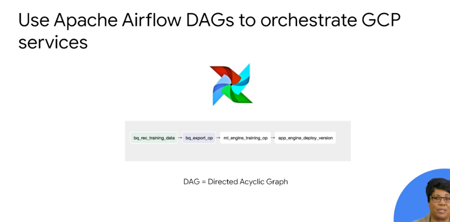

# Cloud Data Fusion

https://googlecoursera.qwiklabs.com/focuses/16999352

     cloud-datafusion-management-sa@i5e7585719848e1e2-tp.iam.gserviceaccount.com 

JEXL expressions

Cloud Data Fusion translates your visually built pipeline into an Apache Spark or MapReduce program that executes transformations on an ephemeral Cloud Dataproc cluster in parallel. 

-------

# Orchestration work between GCP services
Cloud Composer




DAG can do almost any pipeline across 4 different servers.

Predefined operators.

There's a lot of them. All of this is in Python.
Except for event triggering, which is js.

-------

## Quiz

Q1.
Cloud Data Fusion is the ideal solution when you need
* to build visual pipelines

---

## Lab

qwiklabs-gcp-01-02d094282133

Orquestrator flow

```python
"""Example Airflow DAG that creates a Cloud Dataproc cluster, runs the Hadoop
wordcount example, and deletes the cluster.

This DAG relies on three Airflow variables
https://airflow.apache.org/concepts.html#variables
* gcp_project - Google Cloud Project to use for the Cloud Dataproc cluster.
* gce_zone - Google Compute Engine zone where Cloud Dataproc cluster should be
  created.
* gcs_bucket - Google Cloud Storage bucket to used as output for the Hadoop jobs from Dataproc.
  See https://cloud.google.com/storage/docs/creating-buckets for creating a
  bucket.
"""

import datetime
import os

from airflow import models
from airflow.contrib.operators import dataproc_operator
from airflow.utils import trigger_rule

# Output file for Cloud Dataproc job.
output_file = os.path.join(
    models.Variable.get('gcs_bucket'), 'wordcount',
    datetime.datetime.now().strftime('%Y%m%d-%H%M%S')) + os.sep
# Path to Hadoop wordcount example available on every Dataproc cluster.
WORDCOUNT_JAR = (
    'file:///usr/lib/hadoop-mapreduce/hadoop-mapreduce-examples.jar'
)
# Arguments to pass to Cloud Dataproc job.
wordcount_args = ['wordcount', 'gs://pub/shakespeare/rose.txt', output_file]

yesterday = datetime.datetime.combine(
    datetime.datetime.today() - datetime.timedelta(1),
    datetime.datetime.min.time())

default_dag_args = {
    # Setting start date as yesterday starts the DAG immediately when it is
    # detected in the Cloud Storage bucket.
    'start_date': yesterday,
    # To email on failure or retry set 'email' arg to your email and enable
    # emailing here.
    'email_on_failure': False,
    'email_on_retry': False,
    # If a task fails, retry it once after waiting at least 5 minutes
    'retries': 1,
    'retry_delay': datetime.timedelta(minutes=5),
    'project_id': models.Variable.get('gcp_project')
}

with models.DAG(
        'composer_sample_quickstart',
        # Continue to run DAG once per day
        schedule_interval=datetime.timedelta(days=1),
        default_args=default_dag_args) as dag:

    # Create a Cloud Dataproc cluster.
    create_dataproc_cluster = dataproc_operator.DataprocClusterCreateOperator(
        task_id='create_dataproc_cluster',
        # Give the cluster a unique name by appending the date scheduled.
        # See https://airflow.apache.org/code.html#default-variables
        cluster_name='composer-hadoop-tutorial-cluster-{{ ds_nodash }}',
        num_workers=2,
        region='us-central1',
        zone=models.Variable.get('gce_zone'),
        image_version='2.0',
        master_machine_type='n1-standard-2',
        worker_machine_type='n1-standard-2')

    # Run the Hadoop wordcount example installed on the Cloud Dataproc cluster
    # master node.
    run_dataproc_hadoop = dataproc_operator.DataProcHadoopOperator(
        task_id='run_dataproc_hadoop',
        region='us-central1',
        main_jar=WORDCOUNT_JAR,
        cluster_name='composer-hadoop-tutorial-cluster-{{ ds_nodash }}',
        arguments=wordcount_args)

    # Delete Cloud Dataproc cluster.
    delete_dataproc_cluster = dataproc_operator.DataprocClusterDeleteOperator(
        task_id='delete_dataproc_cluster',
        region='us-central1',
        cluster_name='composer-hadoop-tutorial-cluster-{{ ds_nodash }}',
        # Setting trigger_rule to ALL_DONE causes the cluster to be deleted
        # even if the Dataproc job fails.
        trigger_rule=trigger_rule.TriggerRule.ALL_DONE)

    # Define DAG dependencies.
    create_dataproc_cluster >> run_dataproc_hadoop >> delete_dataproc_cluster
```


1. DataprocClusterCreateOperator: Creates a Cloud Dataproc cluster.
2. DataProcHadoopOperator: Submits a Hadoop wordcount job and writes results to a Cloud Storage bucket.
3. DataprocClusterDeleteOperator: Deletes the cluster to avoid incurring ongoing Compute Engine charges.

```bash
gsutil cp gs://cloud-training/datawarehousing/lab_assets/hadoop_tutorial.py gs://us-central1-highcpu-d36b1e05-bucket/dags
```