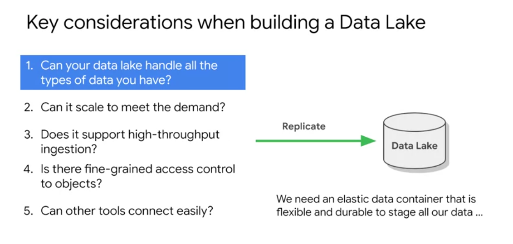
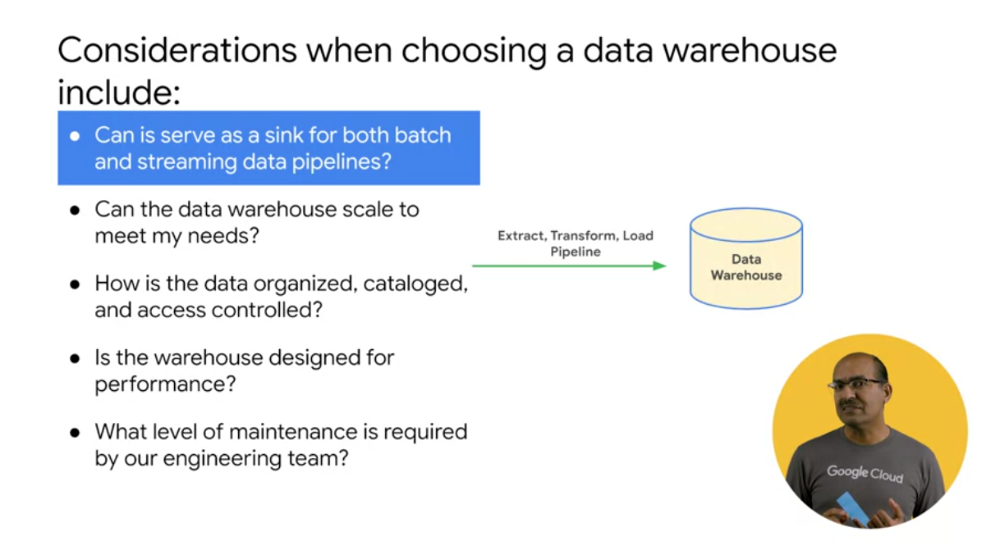
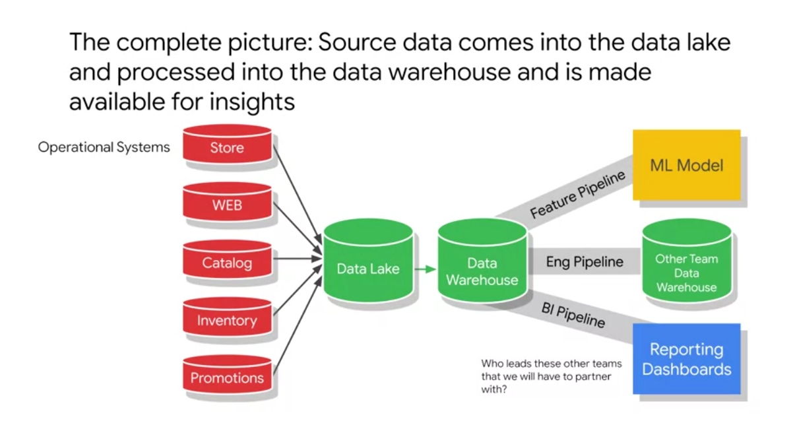
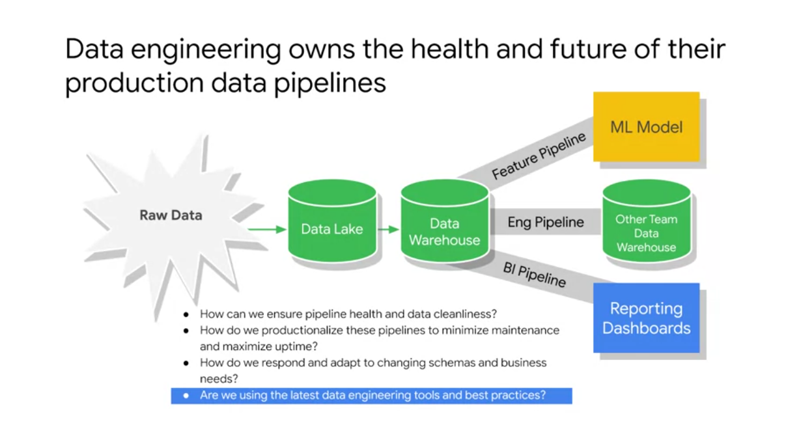
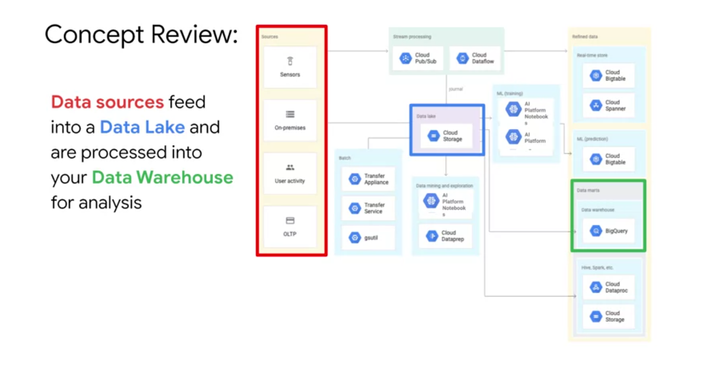

# Modernizing Data Lakes and Data Warehouses

## [Github link](https://github.com/GoogleCloudPlatform/training-data-analyst/tree/master/courses/data-engineering)

Data enginners want build a pipeline, for biz to make a dashboard, report, etc...

Data has to be in usable conditions.

Considerations of a data lake

Data lake is a tool to make it easy to access for data analytics.

## Challenges

- Access to Data
- Data accuracy and quality
- Availability of cimptational resources
- Query performance

Data must be cleaned and transformed.

------------------

To ML Engineers:
How fast are features available at production?
How fast is it to add new columns/features to model?

Data Cataloguen atively extends
* BigQuery
* Pub/Sub
* Cloud Storage

It lays foundation for data governance.
> Enforce data security policies and maintain compliance through Cloud IAM and Cloud DLP integrations, that help ensure the right people gain access to the right data and sensitive data is protected. 
-------------
Data Engineer
- Responsable for the health of the pipelines.

----------------------

