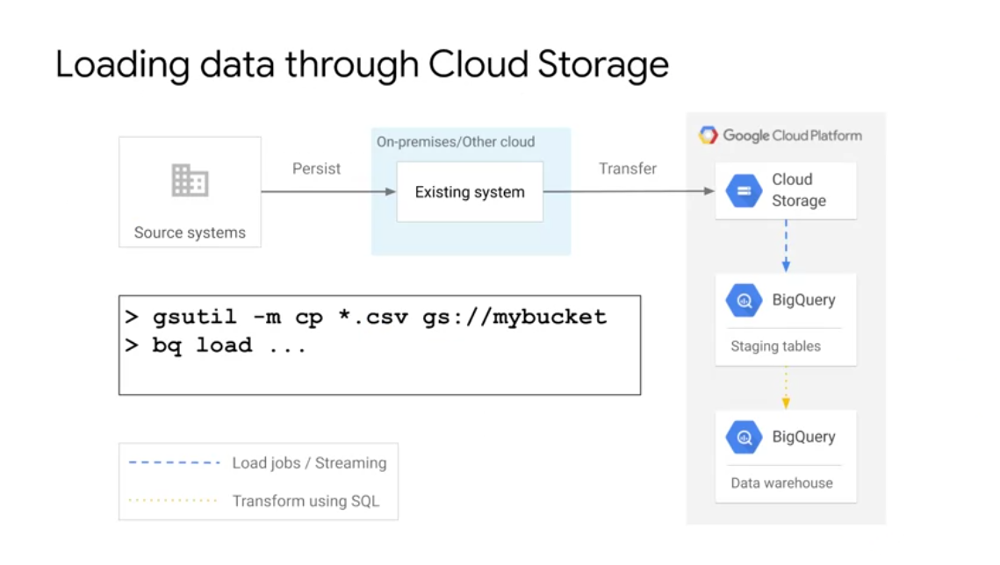
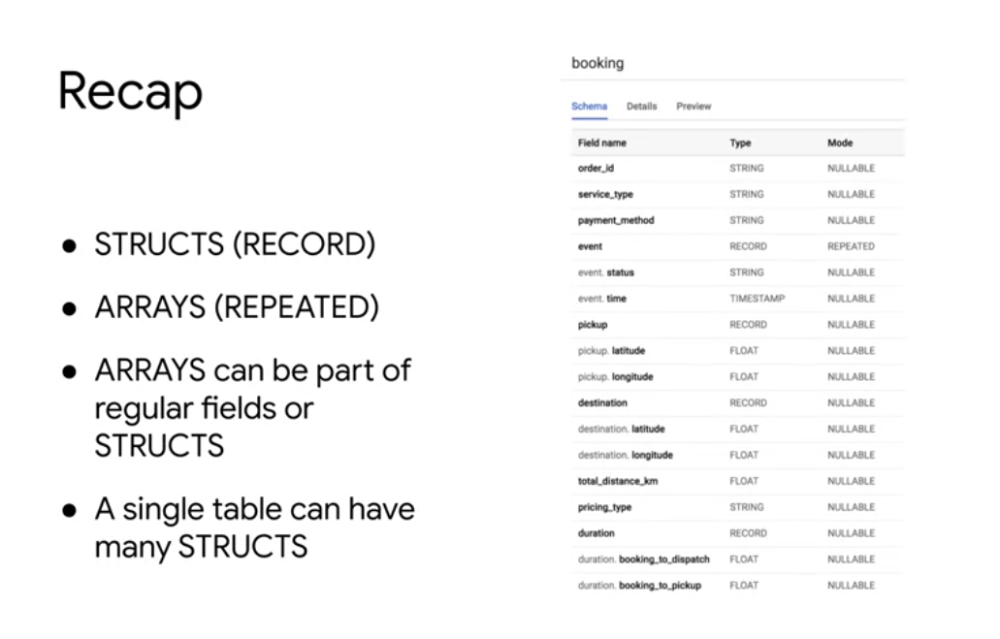

# Building a data warehouse

* Single warehouse that can scale
* Serverless and no-ops (inc ad hoc queries)
* Ecosystem of visualization and reporting tools
* Ecosystem of ETL and data processing tools
* Up-to-the-minute data
* Machine Learning
* Security and collabortaion

BigQuery as all this.

-----------------

[Github Demo for Querying in BigQuery (Wikipedia data)](https://github.com/GoogleCloudPlatform/training-data-analyst/blob/master/courses/data-engineering/demos/bigquery_scale.md)

BigQuery can listen to Cloud Storage to trigger an event into data loading.

Through the API we can load data into BigQuery

## Nested and Repeated Fields

