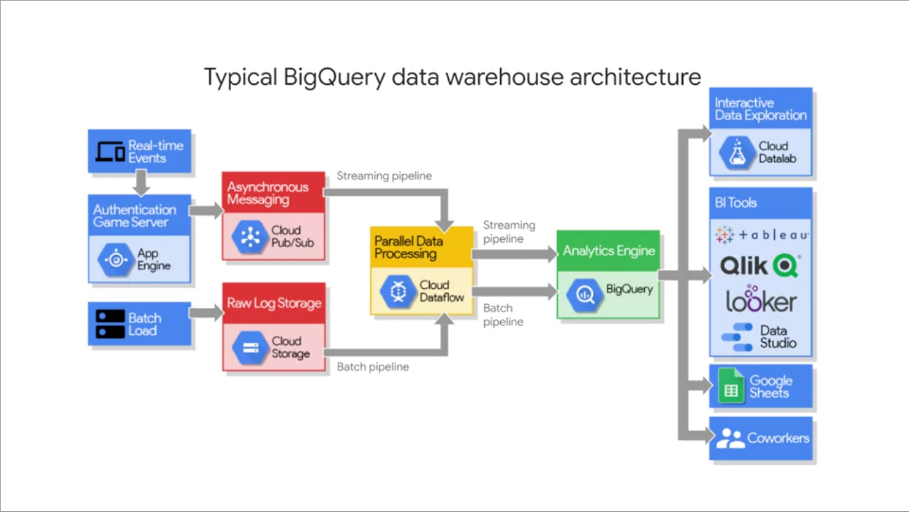

# BigQuery

* Fast SQL query Engine
* Managed Storage for datasets

-----
Its serverless!

How does BigQuery work?

Two services are connected by Google Network
We don't need to worry about the infrastructure, BigQuery does that for you.

------

* Define quality threshold before building a model.
* Try simple models, to know if ML is even a viable solution to your model.

